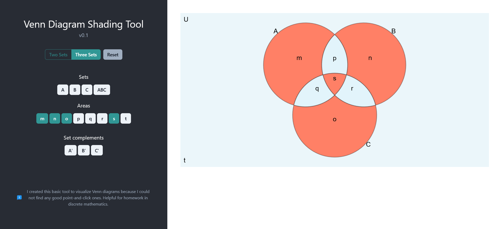

# Venn Diagram Shading Tool

Aid to visualizing unions and intersections between sets in Venn diagrams. I went looking for such a tool and (to my surprise) couldn’t really find a decent one. Very helpful when learning set theory.

Supports Venn diagrams with two or three sets

[🚀 Open the Venn Diagram Shading Tool](https://galloppinggryphon.github.io/venn-shader/)

## Credits

Built with [Vite](https://vitejs.dev/) (for speed and simplicity) and React 18.

Builds on the Venn Diagram Chart plugin for Chart.js: <https://github.com/upsetjs/chartjs-chart-venn>.

## License

MIT
